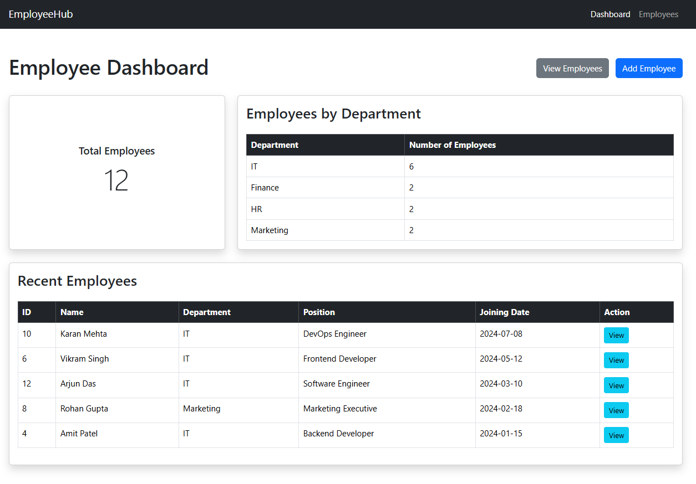
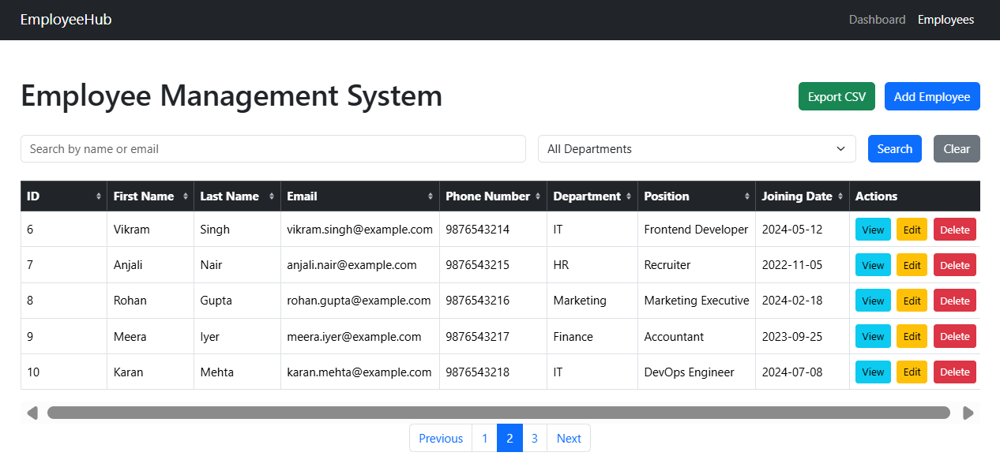
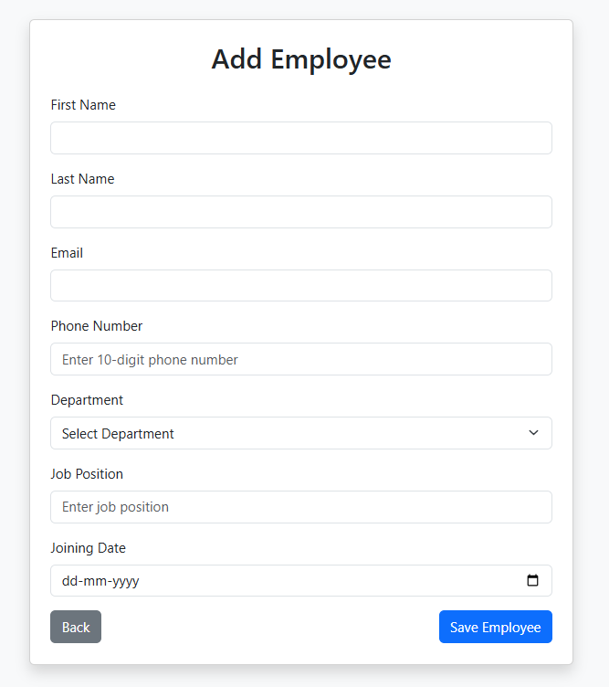
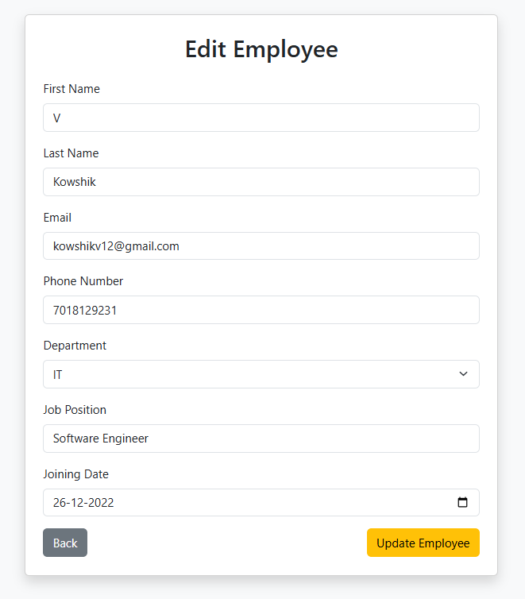
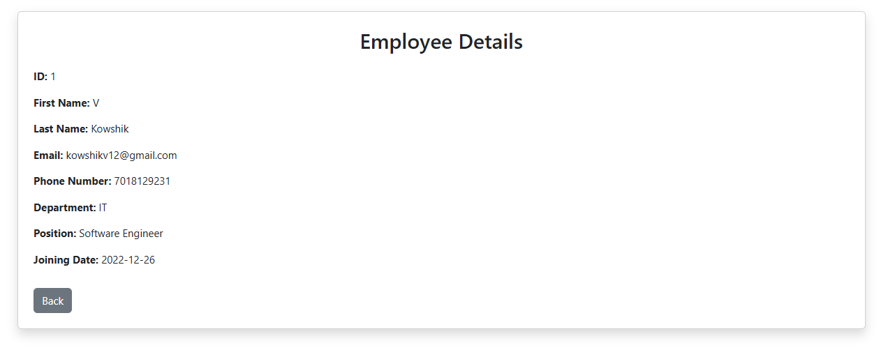

# EmployeeHub

EmployeeHub is a web-based Employee Management System built using Spring Boot. It allows users to manage employee information through a simple and responsive interface.

## Live Demo

[EmployeeHub](https://employeehub-w4on.onrender.com)

## Features

- Add new employees
- View employee details
- Edit employee information
- Delete employees
- Search employees by name or email
- Filter employees by department
- Sort employee records
- Pagination for employee records
- Employee dashboard
- Total employee count
- Department-wise employee statistics
- Recent employees section
- CSV export
- Form validation
- Duplicate email validation
- Custom error handling
- Delete confirmation
- Responsive user interface

## Technologies Used

### Backend
- Java
- Spring Boot
- Spring Data JPA
- Hibernate

### Frontend
- HTML
- CSS
- Bootstrap
- Thymeleaf

### Database
- PostgreSQL

### Tools
- IntelliJ IDEA
- Git
- GitHub
- Maven
- Docker
- Render

## Project Structure

```text
employee-management-system
│
├── src
│   └── main
│       ├── java
│       │   └── com.kowshik.ems
│       │       ├── controller
│       │       ├── model
│       │       ├── repository
│       │       └── service
│       │
│       └── resources
│           ├── static
│           ├── templates
│           └── application.properties
│
├── pom.xml
├── Dockerfile
├── .dockerignore
└── README.md
```

## Architecture

EmployeeHub follows a layered architecture:

Controller → Service → Repository → PostgreSQL

- **Controller:** Handles HTTP requests and responses
- **Service:** Contains business logic
- **Repository:** Handles database operations using Spring Data JPA
- **Model:** Represents employee data
- **Thymeleaf:** Renders dynamic HTML pages

## Setup and Installation

### 1. Clone the repository

    git clone https://github.com/Koushik13579/EmployeeHub.git
    cd EmployeeHub

### 2. Open the project

Open the project in IntelliJ IDEA and allow Maven to download the required dependencies.

### 3. Configure PostgreSQL

Create a PostgreSQL database:

    CREATE DATABASE employee_management;

### 4. Configure database environment variables

The application reads database credentials from environment variables.

Set the following variables:

    SPRING_DATASOURCE_URL=jdbc:postgresql://localhost:5432/employee_management
    SPRING_DATASOURCE_USERNAME=postgres
    SPRING_DATASOURCE_PASSWORD=your_password

Do not commit your actual database password to GitHub.

### 5. Run the application

Run the Spring Boot application from IntelliJ IDEA or using Maven.

On Windows:

    mvnw.cmd spring-boot:run

Then open:

    http://localhost:8080

## Screenshots

### Employee Dashboard



### Employee List



### Add Employee



### Edit Employee



### Employee Details



The application includes:

- Employee Dashboard
- Employee List
- Add Employee
- Edit Employee
- Employee Details


## Future Improvements

- User authentication and authorization
- Role-based access control
- Employee profile images
- Advanced reporting
- REST API support

## Author

Kowshik
